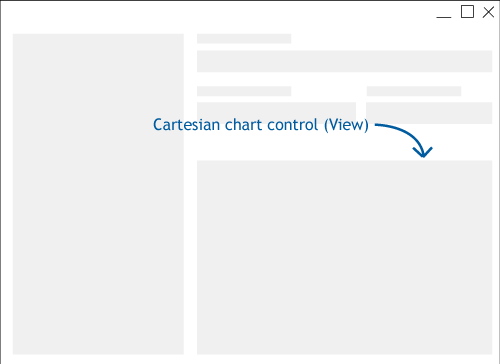
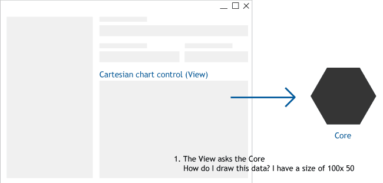

# How it works

This section describes what is behind LiveCharts, specially how the drawing engine works, and how it detects data changes.

# Drawing

### The problem

The library requires to provide a way to display data as a chart, over the time Microsoft created
multiple client frameworks, and now as .Net in the client side community keeps growing, there are even 
many interesting community leaded projects such as Uno platform and Avalonia UI, How do we create an easy to
maintain control that can help as many developers as possible? ideally it should run on any .Net platform.

### LiveCharts solution

The library is divided in 2 main modules, the **Core** and the **View** (or views), basically the **Core** 
calculates the size and position of every shape and the **View** will draw them.

Lets explain the cycle of the library with a simple sample, for this case we need to draw a column series, 
that will only have 3 points.

The following image represents the expected result (*image A*):

<p align="center">
  
</p>

We are building a user interface using windows forms, where we placed a cartesian chart control as follows:

<p align="center">
  
</p>

As we know, the control should render *image A*, to achieve this, the control **View** will ask the **Core** 
what shapes do I need to draw? with that question the **View** will also send input information, such as the 
control size or the number of points the **View** is trying to draw.

The **Core** will answer you need to draw 3 rectangles, at this coordinates and with this sizes, simple isn't it? 
Just keep in mind that the **Core** has no idea of how a rectangle is drawn, it will only send an object 
containing the required information.

That is not exactly what is going, but it explains the idea behind it, actually the **Core** defines the 
`ISizedGeometry` interface, this interface defines size and location properties, but that is not
all, the `ISizedGeometry` interface also implements `IDrawable` where  `IDrawable`  must at least define a 
`Draw()` method, being this method responsible for drawing the rectangle in the user interface (*diagram B*).

<p align="center">
  
</p>

That is how the library draws the final chart, but the library provides animations, then how is the library 
animating the chart? well the library is creating a lot of images, each image (frame) has a position in time 
and we replace the image of the chart as the time elapses.

<p align="center">
  
</p>

The **Core** provides a simple (and enough) framework where we an [IAnimatable](https://github.com/beto-rodriguez/LiveCharts2/blob/master/src/LiveChartsCore/Drawing/IAnimatable.cs) 
object knows [its position in a time line](https://github.com/beto-rodriguez/LiveCharts2/blob/master/src/LiveChartsCore/Drawing/IAnimatable.cs#L30), an `IAnimatable` object defines [Motion properties](https://github.com/beto-rodriguez/LiveCharts2/blob/master/src/LiveChartsCore/Motion/MotionProperty.cs) 
properties.

Take a look at the [LineGeometry class](https://github.com/beto-rodriguez/LiveCharts2/blob/master/src/skiasharp/LiveChartsCore.SkiaSharp/Drawing/Geometries/LineGeometry.cs), specially at the [X1 property](https://github.com/beto-rodriguez/LiveCharts2/blob/master/src/skiasharp/LiveChartsCore.SkiaSharp/Drawing/Geometries/LineGeometry.cs#L43), notice the setter and the getter of the property are linked to the [x1 FloatMotion property](https://github.com/beto-rodriguez/LiveCharts2/blob/master/src/skiasharp/LiveChartsCore.SkiaSharp/Drawing/Geometries/LineGeometry.cs#L34).

[Motion properties](https://github.com/beto-rodriguez/LiveCharts2/blob/master/src/LiveChartsCore/Motion/MotionProperty.cs) 
are the key to generate animations easily for the library, it is actually extremely easy:

``` c#
var line = new LineGeometry();
line.X1 = 0;

// ...

line.X1 = 100;

// that is it. 
// that means that the X1 property will move
// from 0 to 100 over a time line.
```

Notice the setter of the [X1 property](https://github.com/beto-rodriguez/LiveCharts2/blob/master/src/skiasharp/LiveChartsCore.SkiaSharp/Drawing/Geometries/LineGeometry.cs#L43) 
is calling the [MotionProperty.SetMovement()](https://github.com/beto-rodriguez/LiveCharts2/blob/master/src/LiveChartsCore/Motion/MotionProperty.cs#L75) 
method, it is actually scheduling the value of the property over a time line, this means that this properties 
might not behave as you would normally expect, actually if you call the getter immediately after the setter, you 
will not get the value you just set.

``` c#
var line = new LineGeometry();
line.X1 = 0;

// ... 

// if we immediately call the X1 getter, we will actually get 0 instead of 100
line.X1 = 100;
var x1 = line.X1; // x1 is 0 at this point.

// but as the time elapses
// the getter will return the value of the property according to the IAnimatable.CurrentTime property
// so imagine in this case we are moving from 0 to 100 in 10 seconds using a lineal transition:

// if ONE SECOND has elapsed then:
var x1 = line.X1; // x1 is 10 at this time (1 second) = 100 * (1/10)

// if TWO SECONDS have elapsed then:
var x1 = line.X1; // x1 is 20 at this time (2 second) = 100 * (2/10)

// ...

// if SEVEN SECONDS have elapsed then:
var x1 = line.X1; // x1 is 70 at this time (7 second) = 100 * (7/10)

// finally the animation will complete at 10 seconds
var x1 = line.X1; // x1 is 100 at this time (100 second) = 100 * (10/10)
```

So with animations the *diagram B* would be, from now on, we will call this diagram the **Update cycle**:

<p align="center">
  
</p>

At this point most of the work is done by the core of the library, the View is only drawing the rectangles 
in the user interface.

Live Charts is flexible and we could use anything we want to draw the shapes in the user interface, but there is an 
option that shines, SkiaSharp, it offers a a cross-platform 2D graphics API for .NET platforms based on Google's Skia 
graphics library, LiveCharts uses SkiaSharp's API to draw all the shapes for all the supported platforms.

Each platform shares around 90% of the code, this makes it easier to maintain and maximizes the possible amount of 
users we can help with the library.

# Data Changes

LiveCharts changes detection is based on `INotifyPropertyChanged` and `INotifyCollectionChanged` interfaces, both 
provided by the .Net framework, every time a property or a collection changes and the object implements any of these 
interfaces, the chart throttles a **Measure request**, this means that the library will not update every time a 
change happens, it will only update once every 10 ms (by default).

Once the **Measure request** actually runs, it will calculate the final size and position of every shape in our chart, 
then the **Update cycle** will start to draw every shape and will be in a loop until all the `MotionProperties` of 
our shapes are completed.

LiveCharts changes detection is handled by the [CollectionDeepObserver](https://github.com/beto-rodriguez/LiveCharts2/blob/master/src/LiveChartsCore/Kernel/CollectionDeepObserver.cs) 
class, this objects makes it easy for the library to listen and stop listening to changes in all the objects that 
must fire an update in the library. Listeners must be removed automatically by the library, if not, then it is a bug, 
you can call the `Dispose` method if you are facing memory leaks issues, but it is not the intention, the library 
should handle that automatically.

Normally all the objects defined by the library already implement `INotifyPropertyChanged` or 
`INotifyCollectionChanged` but lets take a look at the special cases of the `Chart.Series` and `Series.Values` 
properties, these are properties where the user passes the values the chart must draw in the user interface, so it is 
up to the developer to implement any of those interfaces, implementing both interfaces should not have a significant 
performance impact in most of the cases, but there might be cases where performance might be improved if none of these 
interfaces are implemented. 

``` c#
// CHART.SERIES 

// in this case, the chart will not fire an update
// since List.Add() is not invoking INotifyCollectionChanged.CollectionChanged event
myChart.Series = new List<ISeries>();
myChart.Series.Add(new LineSeries() { Values = new []{ 1, 2, 3} });

// in this case it will update the chart
// since the ObservableCollection class provided by .Net
// already implements the INotifyCollectionChanged interface
myChart.Series = new ObservableCollection<ISeries>();
myChart.Series.Add(new LineSeries() { Values = new []{ 1, 2, 3} });

// for both previous cases
// the LineSeries class, already implements INotifyPropertyChanged
// this means that updating any property in the series will redraw the chart.
myChart.Series[0].Values = new []{ 4, 5, 6}; // this will fire an update


// SERIES.VALUES

// the following sample will not fire an update
// since the City class does not implements INotifyPropertyChanged
public class City
{
  public double Population { get; set; }
}

var seriesCollection = new List<ISeries>();
var lineSeries = new LineSeries 
{ 
  Values = new List<City> 
  { 
    new City { Population = 10 }, 
    new City { Population = 20 } 
  } 
};

lineSeries.Values[0].Population = 20; // will NOT update the chart

myChart.Series = seriesCollection;


// finally the next sample will update the chart automatically
// since the City class does implements INotifyPropertyChanged
public class City : INotifyPropertyChanged
{
  private double? population;

  public double Population { get => population; set { x = population; OnPropertyChanged(); } }

  protected virtual void OnPropertyChanged([CallerMemberName] string? propertyName = null)
  {
    PropertyChanged?.Invoke(propertyName, new PropertyChangedEventArgs(propertyName));
  }
}

var seriesCollection = new List<ISeries>();
var lineSeries = new LineSeries 
{ 
  Values = new List<City> 
  { 
    new City { Population = 10 }, 
    new City { Population = 20 } 
  } 
};

lineSeries.Values[0].Population = 20; // will UPDATE the chart

myChart.Series = seriesCollection;

// the library already provides many ready to use objects that will update the chart automatically
// for example, the ObservableValue class
// https://github.com/beto-rodriguez/LiveCharts2/blob/master/src/LiveChartsCore/Defaults/ObservableValue.cs
```